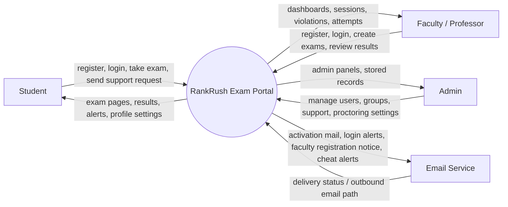
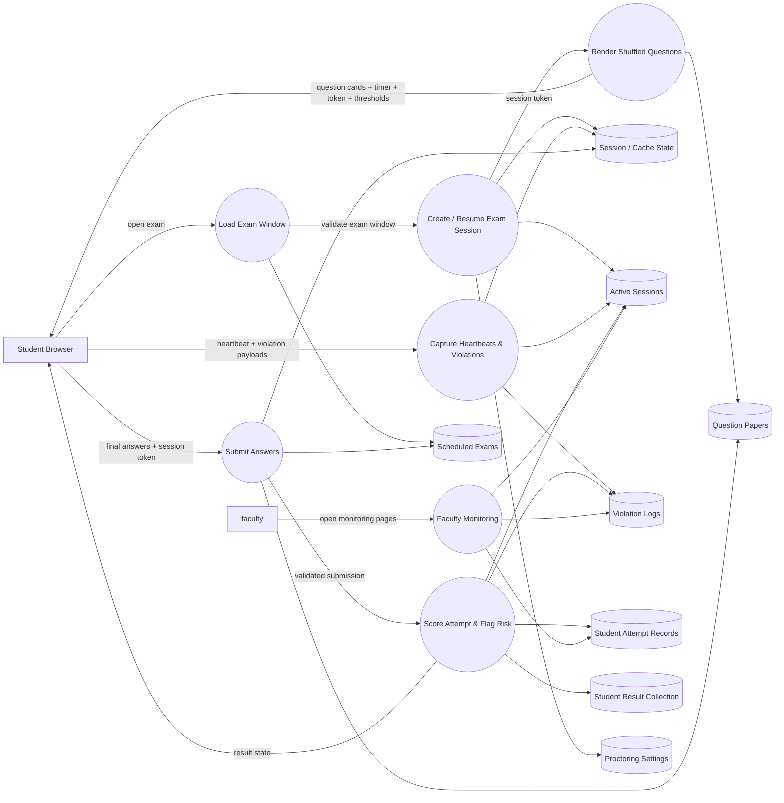

# RankRush Exam Portal DFD

This document captures the working data flow of the full Django project in [`Exam/`](./).

Visual diagrams:

- Combined visual: [`PROJECT_DFD.svg`](./PROJECT_DFD.svg)
- Context DFD: [`DFD_CONTEXT.svg`](./DFD_CONTEXT.svg)
- Level-1 DFD: [`DFD_LEVEL1.svg`](./DFD_LEVEL1.svg)
- ERD: [`ERD_PROJECT.svg`](./ERD_PROJECT.svg)
- FDD: [`FDD_PROJECT.svg`](./FDD_PROJECT.svg)

## 1. Context-Level DFD

## 2. Level-1 DFD

```mermaid
flowchart TD
    student[Student]
    faculty[Faculty / Professor]
    admin[Admin]
    mail[Email Service]

    p1((P1 Portal & Authentication))
    p2((P2 Profile, Preferences & Support))
    p3((P3 Question Bank & Exam Authoring))
    p4((P4 Exam Delivery & Submission))
    p5((P5 Proctoring & Session Monitoring))
    p6((P6 Results, Analytics & Review))

    d1[(D1 Users & Groups)]
    d2[(D2 Student Profiles)]
    d3[(D3 Faculty Profiles)]
    d4[(D4 Question Bank)]
    d5[(D5 Question Papers)]
    d6[(D6 Scheduled Exams)]
    d7[(D7 Student Attempts & Results)]
    d8[(D8 Active Exam Sessions)]
    d9[(D9 Violation Logs)]
    d10[(D10 Preferences & Support Tickets)]
    d11[(D11 Media Uploads)]
    d12[(D12 Session / Cache State)]
    d13[(D13 Proctoring Settings)]

    student -->|signup, login, password reset, validation| p1
    faculty -->|signup, login, password reset| p1
    admin -->|activate faculty, assign Professor group| p1
    p1 --> d1
    p1 --> d2
    p1 --> d3
    p1 --> mail

    student -->|update email preference, change password, raise support ticket| p2
    faculty -->|raise support ticket| p2
    p2 --> d1
    p2 --> d10

    faculty -->|create questions, upload images, create papers, schedule exams| p3
    p3 --> d4
    p3 --> d5
    p3 --> d6
    p3 --> d11

    student -->|open exam, answer questions, submit paper| p4
    p4 --> d5
    p4 --> d6
    p4 --> d7
    p4 --> d12
    p4 --> d13

    student -->|heartbeat, webcam/audio/focus signals, violation reports| p5
    faculty -->|view live sessions and violation dashboard| p5
    admin -->|tune global proctoring settings| p5
    p5 --> d8
    p5 --> d9
    p5 --> d12
    p5 --> d13
    p5 --> mail

    student -->|view rank, previous exams, attendance, result| p6
    faculty -->|view attempts, risk level, student progress, reset attempt| p6
    p6 --> d6
    p6 --> d7
    p6 --> d8
    p6 --> d9
```

## 3. Exam And Proctoring Runtime DFD

## 4. Process-To-Code Mapping

- `P1 Portal & Authentication`
  - `examProject/views.py`
  - `student/views.py`
  - `student/api.py`
  - `faculty/views.py`
- `P2 Profile, Preferences & Support`
  - `studentPreferences/views.py`
  - `studentPreferences/models.py`
- `P3 Question Bank & Exam Authoring`
  - `questions/question_models.py`
  - `questions/questionpaper_models.py`
  - `questions/models.py`
  - `questions/views.py`
- `P4 Exam Delivery & Submission`
  - `questions/views.py`
  - `student/models.py`
- `P5 Proctoring & Session Monitoring`
  - `questions/views.py`
  - `student/models.py`
  - `student/admin.py`
- `P6 Results, Analytics & Review`
  - `student/views.py`
  - `questions/views.py`
  - `student/models.py`

## 5. DFD Working Flow Summary

1. A student or faculty member enters through the homepage and the role-specific auth routes.
2. Student registration creates a Django `User`, `StudentInfo`, and Student group membership, then sends an activation email.
3. Faculty registration creates a pending `User` plus `FacultyInfo`; admin approval is required before faculty login works.
4. Faculty builds `Question_DB` items, groups them into `Question_Paper`, and schedules exams in `Exam_Model`.
5. Student opens an exam, the system checks the time window, creates a session token, stores runtime lock state, and renders shuffled questions.
6. During the exam, the browser sends heartbeat and violation events that update `ActiveExamSession` and `ExamViolationLog`.
7. On submission, the system clones question data into `Stu_Question`, computes score, stores `StuExam_DB`, links it into `StuResults_DB`, and closes the active session.
8. Faculty later reviews attempts, active sessions, and violations; students review results, attendance, history, and ranking-related dashboard data.

## 6. DFD Assumptions

- Admin approval for faculty is inferred from the faculty login flow, which requires both an active account and the `Professor` group.
- Support requests are stored in the database for admin review; they are not emailed directly by the current implementation.
- Runtime exam locking uses Django cache plus session state as a temporary store in addition to the SQLite database.

## 7. ERD Working Flow Summary

1. `auth_user` is the central parent entity for both student and faculty identities used across the project.
2. `StudentInfo`, `FacultyInfo`, and `StudentPreferenceModel` extend a single user record with one-to-one profile and preference data.
3. `SupportTicket` stores repeated support requests against a user, so one user can raise many tickets over time.
4. Faculty-owned `Question_DB` records form the question bank, and `Question_Paper` groups many questions into reusable paper sets.
5. `Exam_Model` links one scheduled exam to one faculty owner and one question paper, creating the publishable exam instance students can attempt.
6. When a student submits an exam, the app creates `Stu_Question` snapshot rows so the original question content and the chosen answer are preserved for that attempt.
7. `StuExam_DB` stores the student attempt header with exam name, linked paper, score, completion state, and the many answered `Stu_Question` rows attached to it.
8. `StuResults_DB` acts as a student-level container that groups one student's completed attempts across multiple exams.
9. `ExamViolationLog` and `ActiveExamSession` connect students, professors, and question papers to the monitoring layer for proctoring, risk review, and live-session tracking.
10. `ProctoringSettings` is a singleton-style configuration entity used globally during exam delivery, even though it is referenced by application logic rather than a direct foreign key.

## 8. ERD Assumptions

- The ERD focuses on the principal application models and keeps Django's internal join tables abstracted, especially for user-group membership and many-to-many bridge tables.
- `Stu_Question` is modeled as a snapshot entity because the code copies question text, options, and media into the student's attempt record instead of reading only from `Question_DB` later.
- `StuResults_DB` is treated as a logical result-aggregation entity for each student, since it groups many `StuExam_DB` rows through a many-to-many relationship.
- `ProctoringSettings` is included in the ERD as a configuration entity even though its project usage is singleton-style and not enforced through foreign-key joins from exam/session tables.

## 9. FDD Working Flow Summary

1. The FDD starts from the full `RankRush Exam Portal` system and breaks it into major functional blocks instead of showing data movement.
2. `User and Access` covers student and faculty registration, login, logout, and role-based entry into the portal.
3. `Profile and Support` groups personal detail handling, notification preferences, password management, and support ticket submission.
4. `Exam Authoring` contains the faculty-side functions for creating questions, building question papers, and scheduling exams.
5. `Exam Execution` contains the student runtime flow for opening an exam, validating the exam window, answering questions, session locking, submitting, scoring, and proctoring.
6. `Review and Admin` covers result viewing, faculty attempt analysis, live monitoring, violation review, and admin approval/settings functions.
7. Lower levels in the FDD refine only the more complex branches, especially exam execution and faculty review, where the project has the richest behavior.

## 10. FDD Assumptions

- The FDD is a functional hierarchy, so it intentionally does not show tables, foreign keys, or request/response data flows.
- Related low-level actions are grouped under broader system capabilities to keep the picture readable and academic-report friendly.
- The decomposition is based on the current Django apps and views, so the function names follow the implemented behavior rather than hypothetical future modules.
